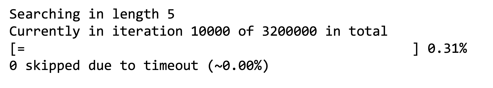

# fizzbrute

Fizzbrute is designed to evaluate and iterate through combinations of tokens to replace a specific character in a given Python code snippet. It helps in finding the correct combination of tokens that produces a desired output string when evaluated as a Python program. The example given in the code is a part of FizzBuzz.

## Usage
Create a file named tokens.txt and populate it with a list of tokens, each on a separate line. These tokens will be used to generate combinations.

Create a file named desired_string.txt and enter the desired output string. The program will compare the generated output with this string to determine if a match is found.

Modify the PYTHON_CODE constant in the main function to contain the Python code snippet you want to evaluate. Replace the character to be replaced with the placeholder character.

Optionally, modify the CHAR_TO_REPLACE constant in the main function to change the character used as a placeholder.

Run the program by executing the following command in the terminal:

    cargo run

The program will iterate through different combinations of tokens and evaluate the Python code snippet with each combination. If a combination produces the desired output string, it will be written to the output.txt file.

During the iteration process, the program will print progress information, including the current combination length, iteration number, and progress percentage. This information helps track the program's progress.

## Customization

If you want to adjust the range of combination lengths to be considered, modify the for loop in the main function. The example code considers lengths from seven to nine, but you can change the values according to your needs.

If you want to change the frequency of progress updates, modify the PRINT_EVERY_X_ITERATION parameter. A lower value will provide more frequent updates but may slow down the program.

If you want to change the maximum time a Python code snippet you want to evaluate should take before skipping the evaluation, modify the DURATION_TILL_TIMEOUT parameter. A longer duration might increase the time the program might take to finish. The code provided deems a span of 100 milliseconds to be sufficient.

## Troubleshooting

Make sure the tokens.txt, desired_string.txt and output.txt files are present in the project directory and contain the expected content.

Ensure that the allotted duration, denoted as DURATION_TILL_TIMEOUT, is of sufficient length to allow your hardware the necessary time to evaluate the Python code snippets.